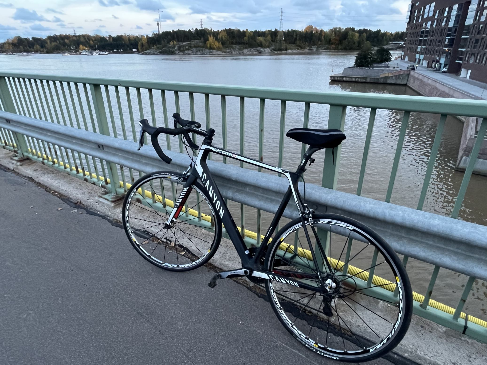

## Introduction

 Welcome! I am Tiankai Zang. I was born in Qingdao, China in 2001, and I am cuurently studying for my Master's degree in language technology at the University of Helsinki.

I like cycling in my free time. If I had the chance to choose again I would seriously thinking about getting trainings at a younger age and becoming a professional cyclist. Here is a photo of my bike to the right, it's a Canyon Ultimate from 2013 (I can't afford a new one), the same model that helped Nairo Quintana win Giro d'Italia in 2014. My favorite sport however is football, I have watched so many  games growing up. One of the best football moment I had is witnessing a small celebration of the 30th anniversery of Denmark's victory in the 1992 Euro, which took place at Parken Stadium in 2022 before a game against Austria.

My CV can be found [here](https://www.overleaf.com/read/gwkvnsnwswbf#b0de6e).

## Find me on

[GitHub](https://github.com/tkzang)

## Contact

My email address is tiankai.zang@helsinki.fi.

## Courses I've Taken

[Command-Line Tools for Linguists](https://studies.helsinki.fi/courses/course-implementation/hy-opt-cur-2425-261401a1-c550-4436-91b9-7edf4a1a3b57), fall 2024

[Introduction to Linguistic Diversity and Digital Humanities](https://studies.helsinki.fi/courses/course-implementation/hy-opt-cur-2425-9df97501-21e6-4b8d-9de4-e91303f2ff71), fall 2024

[Suomi 1A](https://studies.helsinki.fi/courses/course-implementation/hy-opt-cur-2425-f0faf3a8-9268-475f-857b-3e8d0dfec1d8), fall 2024

[Language Technology Research Project](https://studies.helsinki.fi/courses/course-implementation/otm-11a65c0b-ee1b-4866-aa0f-3cae92e8e301), fall 2024

## Projects
[cmdline-course project](https://github.com/tkzang/cmdline-course)

## Misc. 
[My favorite team -- FC København](https://www.fck.dk/) 
